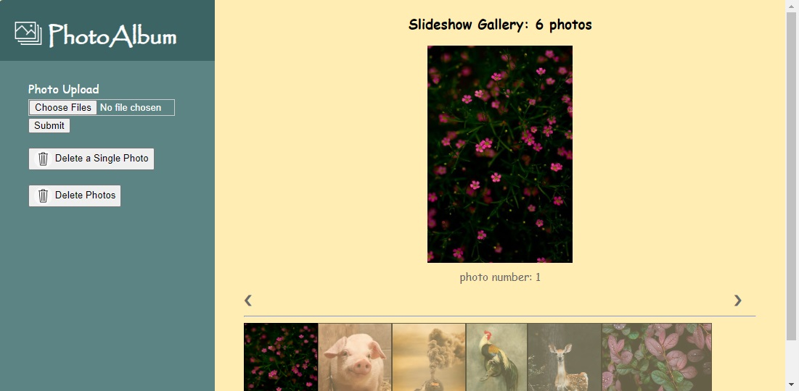

# PhotoAlbum (<font size='3'> V1 </font>)

#### By _**Mahashi-github**_

#### This is a Javascript & Node.js application. Upload photos to albums to get albums with photos sorted by number. You can also select and delete photos.

## Technologies Used
* _html_
* _css_
* _javascript_
* _node.js_
* _express_
* _express router & MVC_
* _ejs_
* _mongoose_
* _multer_
* _uuid_

## Setup
To run this project, install it locally using npm:

```
$ npm install
$ nodemon app
```

## Screenshot of the Application
<p>
  
</p>